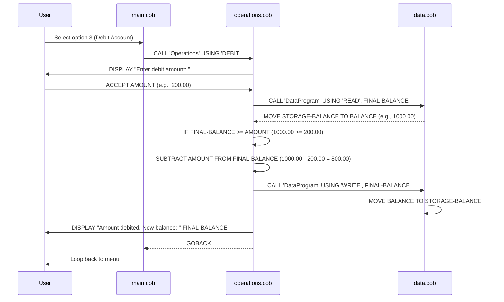

# COBOL Student Account Management System

This project contains a simple COBOL-based system for managing student accounts, focusing on balance operations.

## COBOL Files Overview

### data.cob
**Purpose**: Serves as a data storage module for managing account balance information.

**Key Functions**:
- Stores the current account balance in working storage.
- Provides read/write access to the balance via linkage section parameters.
- Supports 'READ' operation to retrieve the current balance.
- Supports 'WRITE' operation to update the stored balance.

**Business Rules**: None specific; acts as a simple data persistence layer.

### main.cob
**Purpose**: Main entry point and user interface for the account management system, providing a menu-driven interface.

**Key Functions**:
- Displays a menu with options for viewing balance, crediting account, debiting account, and exiting.
- Accepts user input for menu selection.
- Calls the Operations program with appropriate operation types based on user choice.
- Handles invalid menu choices with error messages.
- Continues execution until user chooses to exit.

**Business Rules**: None specific; provides user interaction layer.

### operations.cob
**Purpose**: Handles the core business logic for account operations including balance viewing, crediting, and debiting.

**Key Functions**:
- Processes different operation types: 'TOTAL ' (view balance), 'CREDIT', 'DEBIT '.
- For balance viewing: Retrieves and displays the current balance.
- For crediting: Accepts an amount, adds it to the balance, and updates storage.
- For debiting: Accepts an amount, checks sufficient funds, subtracts if allowed, and updates storage.
- Displays operation results and new balance after successful transactions.

**Business Rules Related to Student Accounts**:
- **Debit Validation**: A debit operation is only allowed if the current account balance is greater than or equal to the requested debit amount. If insufficient funds, the transaction is rejected with an "Insufficient funds" message.
- **Balance Integrity**: All operations maintain balance accuracy through read-modify-write cycles using the data storage module.
- **Transaction Feedback**: Provides clear feedback on transaction success or failure, including updated balance information.

## Sequence Diagram

The following Mermaid sequence diagram illustrates the data flow for a debit operation in the COBOL Student Account Management System:

